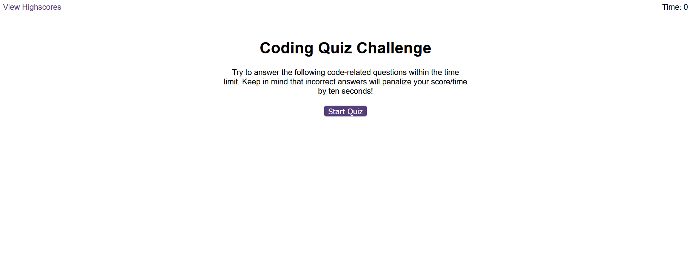
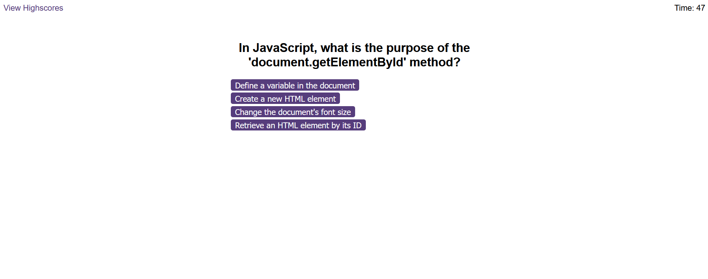
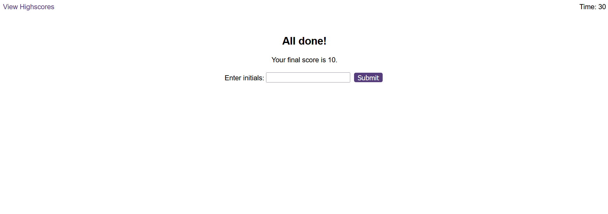
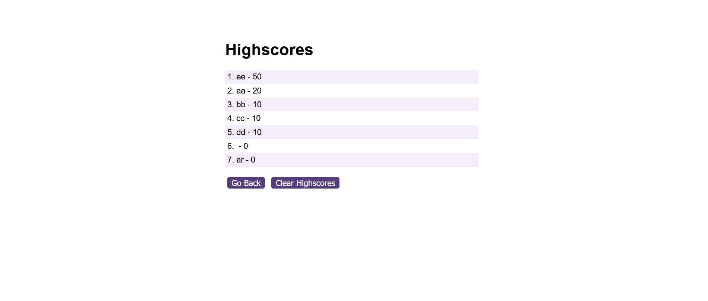

# Quiz Application

A simple quiz application built with HTML, CSS, and JavaScript.

## Table of Contents

- [Live version](#live-version)
- [Description](#📝-description)
- [Features](#💻-features)
- [Logic and Pseudocode](#🧠-logic-and-pseudocode)
- [Screenshots](#📸-screenshots)
- [License](#📜-license)

## 🚀 Live Version

Experience the live version of the Password Generator [HERE](https://thevisualriot.github.io/password-generator/)

## 📝 Description

The Quiz Application is a web-based quiz game designed to test users on their knowledge of JavaScript, HTML, and CSS. It includes a countdown timer, multiple-choice questions, and a mechanism to track and display the final score.

## 💻 Features

- Interactive quiz with multiple-choice questions
- Countdown timer
- Highscores tracking stored in `localStorage`

## 🧠 Logic

1. Display the start screen with a "Start Quiz" button.
2. Upon clicking the "Start Quiz" button, initiate the countdown timer and display the first question.
3. Allow the user to select an answer by clicking the corresponding button.
4. If the answer is correct, increment the score; if wrong, deduct time from the timer.
5. Display whether the answer was correct or wrong for a brief period.
6. Move to the next question.
7. Repeat steps 3-6 until all questions are answered or the timer reaches 0.
8. Display the end screen showing the final score and an input field for initials.
9. Save the user's highscore.
10. Display the list of highscores.

## 📸 Screenshots

## 📜 License
This project is licensed under the [MIT License](https://choosealicense.com/licenses/mit/)
